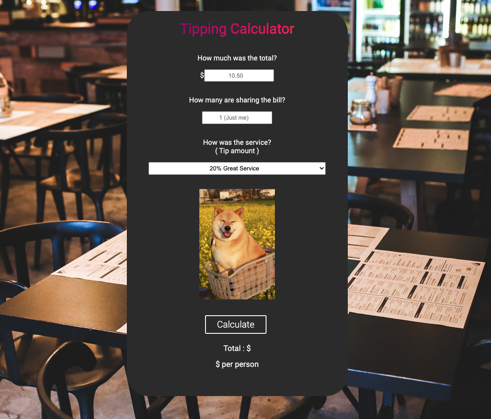

# Tipping-Calculator

## What it does

For when you're splitting the bill with some friends. Just enter the total amount and the tip percentage. The app will calculate how much each person owes.

The calculator will also predict your mood with a funny image based on your tip percentage.

  

## Reflection

This is a great starting project to learn some HTML/CSS/JS. I'd highly recommend building something similar if you're interested. 